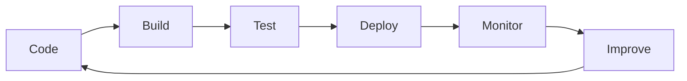

## 🧠 About Me
<p align="center">

</p>
<p align="center">


</p>


```yaml
name: Aman Sharma
role: Cloud & DevOps Engineer
current_company: Oracle Health
location: India

focus:
  - Cloud Infrastructure
  - Kubernetes
  - CI/CD Automation
  - Infrastructure as Code
  - Platform Engineering
  - Site Reliability Engineering

currently_learning:
  - Advanced Kubernetes
  - AWS Services
  - Terraform
  - GitOps
  - Observability

philosophy:
  "Automate everything. Monitor everything. Scale confidently."
```

### 🚀 Building the Future of Infrastructure

I currently work at **Oracle Health**, supporting enterprise-scale healthcare systems that power critical workflows for healthcare organizations across the United States.

My day-to-day responsibilities involve:

* 🔍 Troubleshooting production incidents
* 🐧 Working with Linux-based environments
* 🗄️ Analyzing backend systems using SQL & Oracle Database
* ⚙️ Implementing and validating enterprise application changes
* 🤝 Collaborating with cross-functional technical teams
* 📈 Ensuring reliability for business-critical healthcare platforms

Working in large-scale enterprise environments has given me a strong foundation in **system operations, incident management, troubleshooting, reliability, and backend engineering**.

---

### ☁️ Transitioning from Enterprise Support to Cloud & DevOps Engineering

Beyond my professional role, I am actively building expertise in modern cloud-native technologies through hands-on projects and continuous learning.

I enjoy designing systems that are:

✅ Automated
✅ Observable
✅ Scalable
✅ Resilient
✅ Production Ready

My current engineering toolkit includes:

```text
Cloud         → AWS
Containers    → Docker
Orchestration → Kubernetes
IaC           → Terraform
CI/CD         → GitHub Actions
Monitoring    → Prometheus & Grafana
OS            → Linux
Version Ctrl  → Git & GitHub
```

---

### 🔥 What Excites Me

* Building cloud-native infrastructure
* Automating deployment workflows
* Designing CI/CD pipelines
* Infrastructure as Code (IaC)
* Kubernetes & Container Platforms
* Monitoring & Observability
* Platform Engineering
* Site Reliability Engineering (SRE)

---

### 📊 Engineering Mindset



I am passionate about understanding how software moves from **development → deployment → production → scale** and how engineering teams can leverage automation to deliver reliable systems faster.

---

### 🎯 Career Objective

My goal is to contribute to high-performing engineering teams as a **DevOps Engineer, Cloud Engineer, Platform Engineer, or Site Reliability Engineer**, helping organizations build secure, scalable, and highly available infrastructure through automation and cloud-native technologies.

---

<div align="center">

### ⚡ Current Mission

**Turning manual processes into automation**
**Turning infrastructure into code**
**Turning complexity into reliability**

</div>
