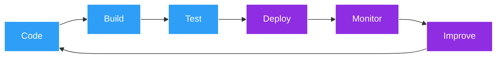

<div align="center">

# 👋 Hi, I'm Aman Sharma

### Cloud & DevOps Engineer | Automation | SRE


<p>
  
</p>

</div>

---

## 🚀 About Me

I currently work at **Oracle Health**, supporting enterprise-scale healthcare systems that power critical workflows for healthcare organizations across the United States.

```yaml
role:        Cloud & DevOps Engineer
company:     Oracle Health
location:    India
philosophy:  "Automate everything. Monitor everything. Scale confidently."
```

My day-to-day involves:

- 🔍 Troubleshooting production incidents in large-scale enterprise environments
- 🐧 Working with Linux-based systems
- 🗄️ Analyzing backend systems using SQL & Oracle Database
- ⚙️ Implementing and validating enterprise application changes
- 🤝 Collaborating with cross-functional technical teams
- 📈 Ensuring reliability for business-critical healthcare platforms

Beyond my professional role, I'm actively transitioning into **Cloud & DevOps Engineering**, building hands-on expertise in modern cloud-native technologies and platform engineering.

---

## 🛠️ Tech Stack

<div align="center">

### Cloud & Infrastructure


### CI/CD & Version Control


### Observability


### OS, Languages & Databases

<br/>


</div>

---

## 📊 My Engineering Mindset



---

## 🌱 Currently Learning

<div align="center">

| Area | Focus |
|---|---|
| ☸️ **Kubernetes** | Advanced workloads, operators, HPA/VPA, service mesh |
| ☁️ **AWS** | EC2, EKS, VPC, IAM, Lambda, CloudWatch |
| 🌍 **Terraform** | Modular IaC, remote state, multi-env provisioning |
| 🔁 **GitOps** | ArgoCD / Flux driven deployment workflows |
| 📈 **Observability** | Prometheus + Grafana + Alertmanager stacks |

</div>

---

## 💼 Featured Projects

<div align="center">

<a href="#">

</a>
<a href="#">

</a>

<a href="#">

</a>
<a href="#">

</a>

</div>


---

## 🔥 What Excites Me

- Building cloud-native infrastructure
- Automating deployment workflows end-to-end
- Designing resilient CI/CD pipelines
- Infrastructure as Code (IaC)
- Kubernetes & container platforms
- Monitoring & observability
- Platform Engineering & SRE practices

---

## 🎯 Career Objective

> Aspiring to contribute to high-performing engineering teams as a **DevOps Engineer**, **Cloud Engineer**, **Platform Engineer**, or **Site Reliability Engineer** — helping organizations build secure, scalable, and highly available infrastructure through automation and cloud-native technologies.

---

## ⚡ Current Mission

```text
Turning manual processes  → into automation
Turning infrastructure    → into code
Turning complexity        → into reliability
```

---

## 📈 GitHub Analytics

<div align="center">


</div>

---

## 🐍 Contribution Snake

<div align="center">

<!-- Add .github/workflows/snake.yml (provided separately) to enable this -->


</div>


---

## 🤝 Connect With Me

<div align="center">

<a href="https://www.linkedin.com/in/amansharma6/"></a>
<a href="mailto:sharmaamanjsr@gmail.com"></a>

</div>
