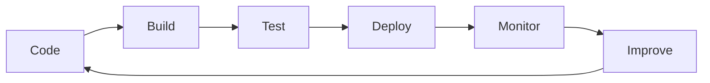

<h1 align="center">Hi, I'm Aman Sharma 👋</h1>
<h3 align="center">Cloud & DevOps Engineer | Building Automated, Observable & Scalable Infrastructure</h3>

<p align="center">
  
</p>

---

### 🚀 About Me

I currently work at **Oracle Health**, supporting enterprise-scale healthcare systems that power critical workflows for healthcare organizations across the United States.

My day-to-day involves:

- 🔍 Troubleshooting production incidents in large-scale enterprise environments
- 🐧 Working with Linux-based systems
- 🗄️ Analyzing backend systems using SQL & Oracle Database
- ⚙️ Implementing and validating enterprise application changes
- 🤝 Collaborating with cross-functional technical teams
- 📈 Ensuring reliability for business-critical healthcare platforms

Beyond my professional role, I'm actively transitioning into **Cloud & DevOps Engineering**, building hands-on expertise in modern cloud-native technologies and platform engineering.

---

### ☁️ What I'm Focused On

```yaml
focus:
  - Cloud Infrastructure
  - Kubernetes
  - CI/CD Automation
  - Infrastructure as Code
  - Platform Engineering
  - Site Reliability Engineering

currently_learning:
  - Advanced Kubernetes
  - AWS Services
  - Terraform
  - GitOps
  - Observability
```

---

### 🛠️ Engineering Toolkit

<p align="left">
  
  
  
  
  
  
  
  
  
  
  
</p>

---

### 📊 My Engineering Mindset



---

### 🔥 What Excites Me

- Building cloud-native infrastructure
- Automating deployment workflows end-to-end
- Designing resilient CI/CD pipelines
- Infrastructure as Code (IaC)
- Kubernetes & container platforms
- Monitoring & observability
- Platform Engineering & SRE practices

---

### 🎯 Career Objective

> Aspiring to contribute to high-performing engineering teams as a **DevOps Engineer**, **Cloud Engineer**, **Platform Engineer**, or **Site Reliability Engineer** — helping organizations build secure, scalable, and highly available infrastructure through automation and cloud-native technologies.

---

### ⚡ Current Mission

```
Turning manual processes  → into automation
Turning infrastructure    → into code
Turning complexity        → into reliability
```

---

<p align="center">
  
</p>

<p align="center">
  
</p>

<p align="center">
  📍 India &nbsp;|&nbsp; 📫 Let's connect and build something reliable together
</p>
